<!-- ========================= -->
<!--        HERO BANNER         -->
<!-- ========================= -->


 

  

  

  

  

---

<!-- ========================= -->
<!--         ABOUT ME           -->
<!-- ========================= -->

<h2>👋 ABOUT ME</h2>

 

<table width="100%">
<tr>

<td width="38%" align="center" valign="middle">

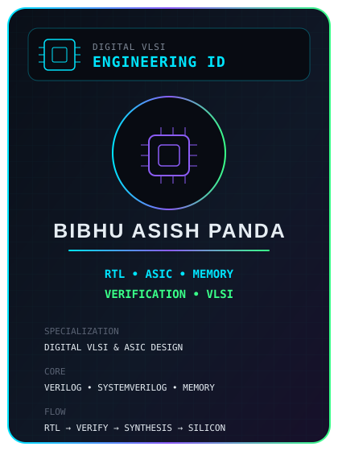

</td>

<td width="62%" valign="middle">

<h2>⚡ Electronics & VLSI Engineer</h2>

I'm an <b>Electronics and Communication Engineering graduate</b>
focused on <b>Digital VLSI, RTL Design, ASIC Design and Verification</b>,
with hands-on experience in Verilog-based digital system design,
FSM modeling, memory architectures and simulation-driven verification.

My work spans <b>RTL development, memory systems, arithmetic circuits,
control logic and SystemVerilog verification</b>, with practical exposure
to Vivado, Verilator, Icarus Verilog and open-source ASIC design flows.

<h3>🔬 Engineering Focus</h3>

<table>

<tr>
<td>🔹 <b>RTL Design</b></td>
<td>🔹 <b>Design Verification</b></td>
</tr>

<tr>
<td>🔹 <b>Memory Design</b></td>
<td>🔹 <b>ASIC Design</b></td>
</tr>

<tr>
<td>🔹 <b>SystemVerilog</b></td>
<td>🔹 <b>Analog IC Design</b></td>
</tr>

</table>

<b>Current Focus:</b> 
<code>RTL → Verification → Synthesis → Physical Implementation</code>

</td>

</tr>
</table>

 

---

---

## 👋 About Me

🎓 Electronics and Communication Engineering graduate focused on **Digital VLSI, RTL Design, and ASIC Design Verification**, with hands-on experience in Verilog-based digital system design, FSM modeling, and simulation-driven verification.

🔧 Experienced in developing and analyzing **RTL architectures, memory systems, arithmetic circuits, and control logic**, with practical exposure to **Verilog/SystemVerilog, Vivado, Icarus Verilog, Verilator, and open-source ASIC design flows**.

🔬 Alongside digital VLSI, I have hands-on experience in **analog IC design and custom layout**, including SRAM cell and array design, analog front-end development, and transistor-level simulation using **Cadence Virtuoso, Xschem, Ngspice, and SkyWater 130 nm PDK**.

🚀 My interests lie in **RTL Design, Design Verification, ASIC Design, Memory Design, and Analog IC Design**, with a strong focus on developing reliable, power-efficient, and implementation-oriented hardware architectures.

---

<!-- ========================================================= -->
<!--                    FEATURED PROJECTS                      -->
<!-- ========================================================= -->

<h2>⭐ FEATURED PROJECTS</h2>

Selected projects across <b>RTL Design, ASIC, Memory, Verification, Analog IC & Embedded Systems</b>

 

<table width="100%">
<tr>

<!-- ===================== PROJECT 1 ===================== -->

<td width="50%" align="center" valign="top">

<a href="https://github.com/BibhuAsish1925/Designing-and-Optimizing-a-5-Stage-Pipelined-64-Bit-ALU-from-RTL-to-GDSII">

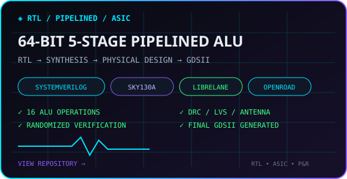

</a>

</td>

<!-- ===================== PROJECT 2 ===================== -->

<td width="50%" align="center" valign="top">

<a href="https://github.com/BibhuAsish1925/AXI4-Lite-ASIC-RTL-Subsystem-with-RAM-and-GPIO-Peripherals">

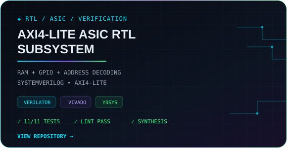

</a>

</td>

</tr>

<tr>

<!-- ===================== PROJECT 3 ===================== -->

<td width="50%" align="center" valign="top">

<a href="https://github.com/BibhuAsish1925/Power-Efficient-16x8-SRAM-Array-Design-and-Layout-Implementation-using-a-Low-Power-7T-SRAM-Cell">

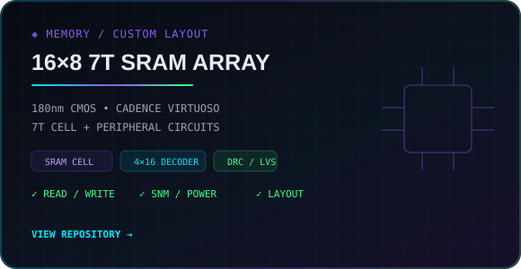

</a>

</td>

<!-- ===================== PROJECT 4 ===================== -->

<td width="50%" align="center" valign="top">

<a href="https://github.com/BibhuAsish1925/Power-efficient-Approximate-Multiplier-via-Clock-gating">

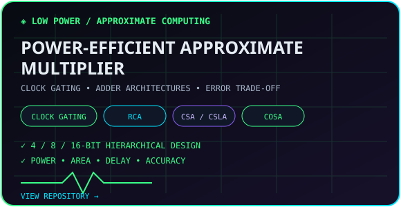

</a>

</td>

</tr>

<tr>

<!-- ===================== PROJECT 5 ===================== -->

<td width="50%" align="center" valign="top">

<a href="https://github.com/BibhuAsish1925/MEMS-Microphone-Analog-Front-End-IC-Design">

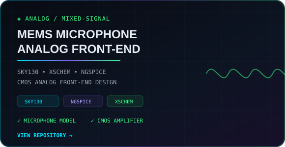

</a>

</td>

<!-- ===================== PROJECT 6 ===================== -->

<td width="50%" align="center" valign="top">

<a href="https://github.com/BibhuAsish1925/Dual-Ultrasonic-sensor-based-Obstacle-detection-and-avoidance-robot">

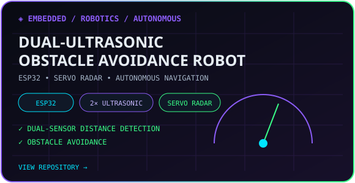

</a>

</td>

</tr>

<tr>

<!-- ===================== PROJECT 7 ===================== -->

<td width="50%" align="center" valign="top">

<a href="https://github.com/BibhuAsish1925/ESP-32-based-Health-Monitoring-Mini-Project-">

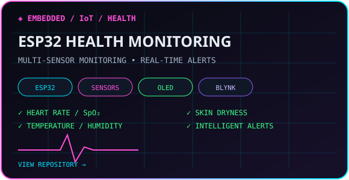

</a>

</td>

<!-- ===================== VIEW ALL PROJECTS ===================== -->

<td width="50%" align="center" valign="middle">

<h3>🚀 EXPLORE ALL PROJECTS</h3>

Browse my complete collection of 
<b>VLSI, RTL, ASIC & Embedded</b> projects.

 

</td>

</tr>

</table>

 

---

<h2>🧰 TECHNICAL SKILLS</h2>

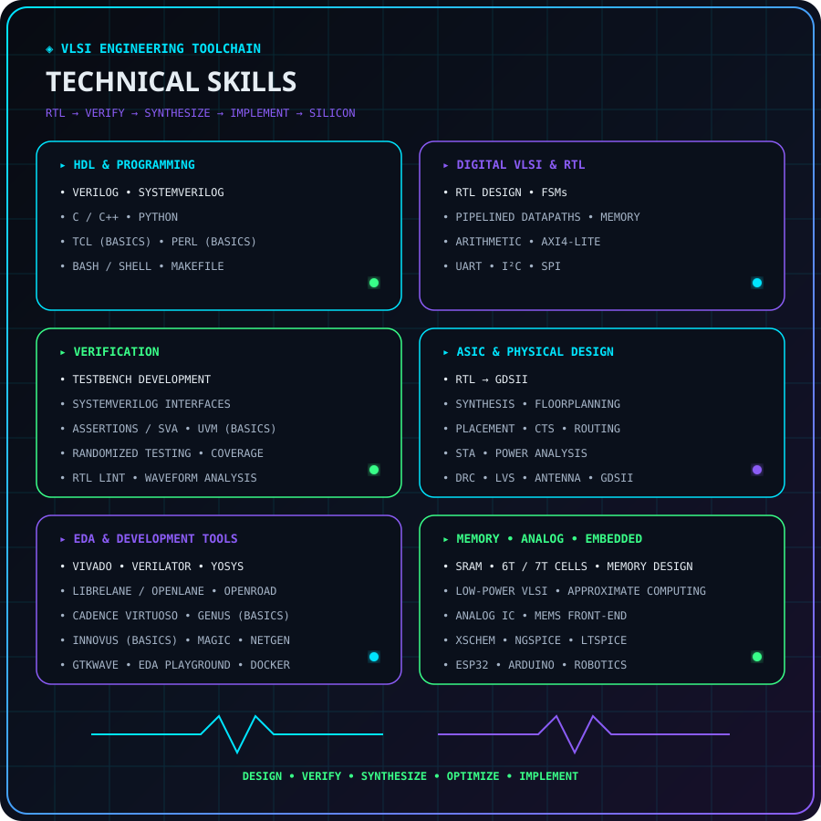

 

---

<!-- ========================================================= -->
<!--                     LET'S CONNECT                         -->
<!-- ========================================================= -->

<a href="https://github.com/BibhuAsish1925">


</a>

 

---
