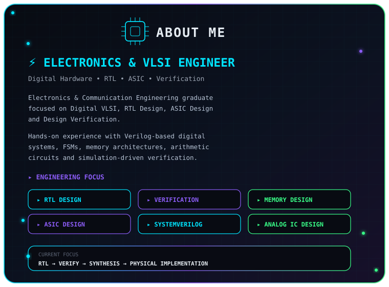
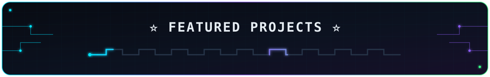

<!-- ========================= -->
<!--        HERO BANNER         -->
<!-- ========================= -->

 

  

  

  

  

<!-- ========================================================= -->
<!--                         ABOUT ME                          -->
<!-- ========================================================= -->

 

<table width="100%">
<tr>

<td width="38%" align="center" valign="middle">

</td>

<td width="62%" align="center" valign="middle">

</td>

</tr>
</table>

 

<!-- ========================================================= -->
<!--                    FEATURED PROJECTS                      -->
<!-- ========================================================= -->

 

<table width="100%">
<tr>

<!-- ===================== PROJECT 1 ===================== -->

<td width="50%" align="center" valign="top">

</td>

<!-- ===================== PROJECT 2 ===================== -->

<td width="50%" align="center" valign="top">

</td>

</tr>

<tr>

<!-- ===================== PROJECT 3 ===================== -->

<td width="50%" align="center" valign="top">

</td>

<!-- ===================== PROJECT 4 ===================== -->

<td width="50%" align="center" valign="top">

</td>

</tr>

<tr>

<!-- ===================== PROJECT 5 ===================== -->

<td width="50%" align="center" valign="top">

</td>

<!-- ===================== PROJECT 6 ===================== -->

<td width="50%" align="center" valign="top">

</td>

</tr>

<tr>

<!-- ===================== PROJECT 7 ===================== -->

<td width="50%" align="center" valign="top">

</td>

<!-- ===================== EXPLORE ALL ===================== -->

<td width="50%" align="center" valign="middle">

<h3>🚀 EXPLORE ALL PROJECTS</h3>

<b>RTL</b> → <b>ASIC</b> → <b>MEMORY</b> → <b>VERIFICATION</b> 
<b>ANALOG</b> → <b>EMBEDDED</b>

 

</td>

</tr>

</table>

 

<!-- ========================================================= -->
<!--                    SECTION TRANSITION                     -->
<!-- ========================================================= -->

 

<!-- ========================================================= -->
<!--                  TECHNICAL SKILLS                         -->
<!-- ========================================================= -->

 

<!-- ========================================================= -->
<!--                     LET'S CONNECT                         -->
<!-- ========================================================= -->

 

---
